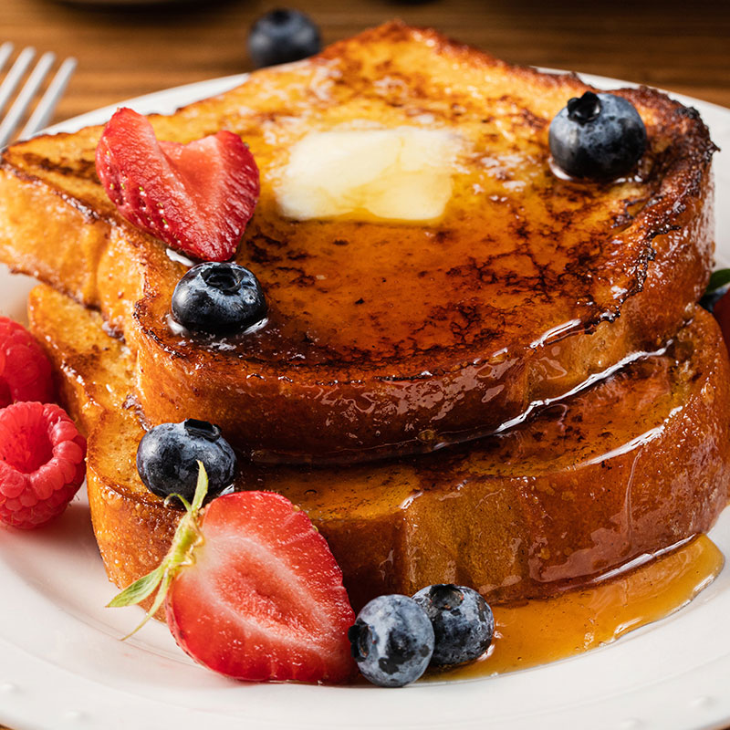

# Description

Serving: 4-6 slices
Prep: 5m
Cook: 20m

## Ingredients

| Qty.       | Item            |
| ---------- | --------------- |
| 1          | Egg             |
| 1 tsp      | Vanilla Extract |
| 1/2 tsp    | Cinnamon        |
| 1/3 cup    | Milk            |
| 4-6 slices | Bread           |

## Steps

1.  Beat egg, vanilla and cinnamon in shallow dish. Stir in milk.
2.  Dip bread in egg mixture, turning to coat both sides evenly.
3.  Cook bread slices on lightly greased nonstick griddle or skillet on medium
    heat until browned
    on both sides. Serve with spiced syrup (recipe follows), if desired.

## Notes

**Easy Spiced Syrup:** Add 1 teaspoon vanilla extract and 1/4 teaspoon ground
cinnamon to 1 cup
pancake syrup; stir well to mix. Serve warm, if desired.

