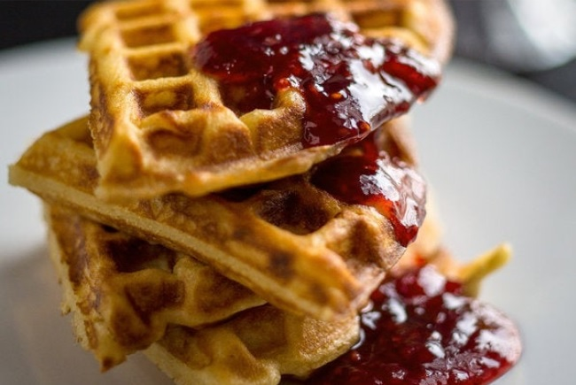

# Description #
Serving: 8-10 waffles
Prep: 1 hr, plus 2-3 hrs' standing
Cook: 45m

# Ingredients
|      Qty.     |             Item             |
| ------------- | ---------------------------- |
|    2 1/4 cups |                         Milk |
|          4 oz |              Unsalted Butter |
|  15g / 1 Tbsp |                        Sugar |
|    5g / 1 tsp |                         Salt |
|     2 1/4 tsp |            Active Dry Yeast  |
|  240g / 2 cup |                     AP Flour |
| 90g / 3/4 cup |      Whole Wheat or AP Flour |
|        2 Large|                         Eggs |
|       1/4 tsp |                  Baking Soda |

# Steps
1. In a small pot over medium heat, combine milk and butter until melted and hot but not simmering. Stir in sugar and salt; remove from heat and let cool to lukewarm.
2. In a large bowl, combine ½ cup warm water and yeast. Let stand until foamy, about 5 minutes.
3. Add warm milk mixture to yeast and stir. Whisk in flours. Cover with plastic wrap and let stand until doubled in volume, 2 to 3 hours at room temperature or overnight in the refrigerator.
4. Heat waffle iron. Whisk eggs and baking soda into waffle batter. Using a pastry brush or paper towel, lightly coat iron with melted butter.
5. Cook waffles (using about ½ cup batter per waffle) until golden and crisp. Butter the iron in between batches as needed. Serve waffles immediately as they are ready, or keep them warm in a 200-degree oven until ready to serve.

# Notes
- Yeast-risen waffles have a lovely, complex tang that works beautifully with whatever sweet topping you apply – honey, maple syrup, fruit jam. You can make the batter the night before and let it rise in the refrigerator until breakfast time. Or, it will rise at room temperature in a couple of hours, which makes these waffles a good choice for brunch. 
- Measurements for dry ingredients are given by weight for greater accuracy. The equivalent measurements by volume are approximate.

