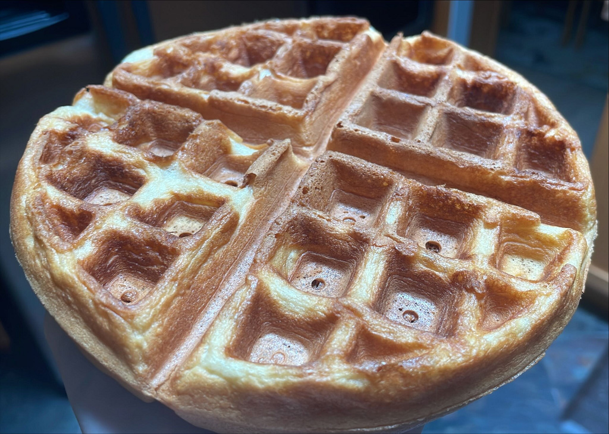

# Belgian Waffles

Serving: 6 waffles
Prep: 25 min
Cook: 45 min

## Ingredients

| Qty.    | Item          |
| ------- | ------------- |
| 2 cups  | Flour         |
| 4 tsp   | Baking Powder |
| 1/2 tsp | Salt          |
| 1/4 cup | Sugar         |
| 2 eggs  | Eggs          |
| 1/2 cup | Canola Oil    |
| 1 cup   | Whole Milk    |
| 1 cup   | Oat Milk      |
| 1 tsp   | Vanilla       |

## Steps

1.  Turn on waffle iron to preheat.
2.  Sift the dry ingredients together in a large bowl.
3.  In a separate bowl, separate eggs whites and beat until stiff peaks form.
    Note it is very important not to get yolk in this, as it will prevent egg
    whites from stiffening.
4.  In a separate bowl, add egg yolks and beat until slackened.
5.  Mix milk, oat milk, oil, and vanilla into egg yolks and stir gently until
    mixed.
6.  Add wet mixture into dry ingredients and mix thoroughly until batter is
    smooth.
7.  Gently fold in egg whites, carefully so as not to lose egg white volume
8.  Cook each waffle approximately 4 min/side

## Notes

- none

