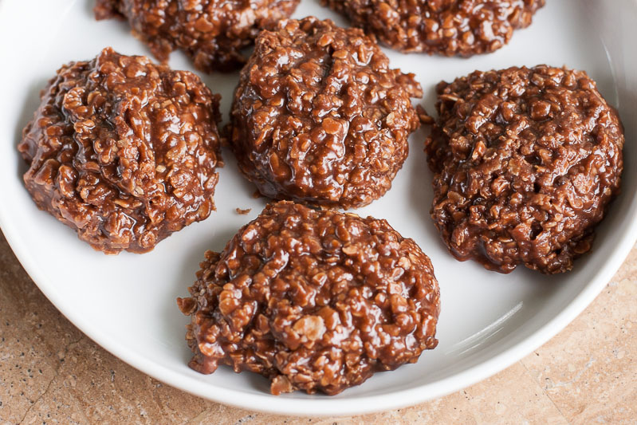

# Chocolate Oatmeal Cookies

| Prep | Bake  | Total | Makes                |
| ---- | ----- | ----- | -------------------- |
| 5min | 15min | 20min | 14 cookies (approx.) |

## Ingredients

| Qty.       | Item            |
| ---------- | --------------- |
| 1 cups     | sugar           |
| 1/4 cup    | cocoa           |
| 1/2 cup    | milk            |
| 1/4 cup    | butter          |
| 1/2 cup    | peanut butter   |
| 1 tsp      | vanilla extract |
| 2 1/2 cups | instant oatmeal |
|            | wax paper       |

## Steps

1. In a medium saucepan, mix sugar, cocoa, and milk.
1. Brink to a full, roiling boil, continue boiling for exactly
   1 minute, then remove from heat.
1. Quickly mix in peanut butter, butter, and vanilla extract.
1. Quickly mix in oatmeal.
1. Immediately scoop cookie-sized balls onto wax paper and slightly
   flatten. Cookies will flatten more as they cool and dry, but
   not as much as oven cookies.

## Notes

- Once you add the oatmeal, the mixture will begin to dry very
  quickly. Be quick or the final cookies will be dry and crumbly.
- For creamier/smoother cookies, use slightly less oatmeal.

