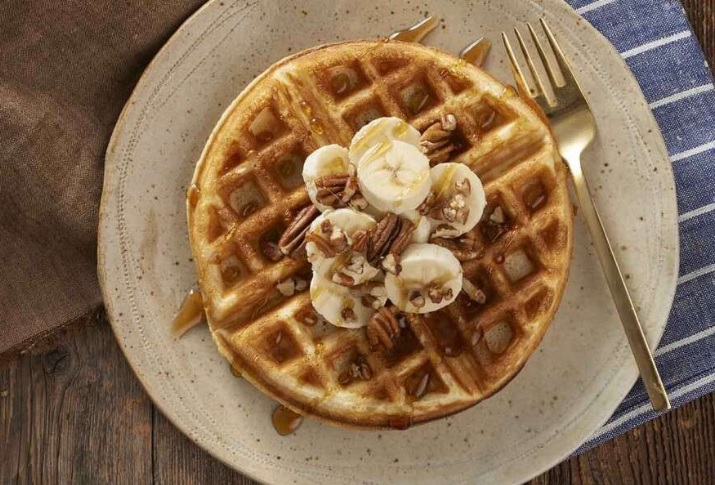

# Yeasted Waffles (Belgian Style)

Serving: 4 waffles
Prep: 30 min
Cook: 30m

## Ingredients

| Qty.              | Item                      |
| ----------------- | ------------------------- |
| 340g / 1 1/2 cups | Milk (lukewarm)           |
| 85g / 6 Tbsp      | Melted (unsalted?) Butter |
| 39-57g / 2-3 Tbsp | Maple Syrup               |
| 3/4 tsp           | Salt                      |
| 1 tsp             | Vanilla Extract           |
| 2 Large           | Eggs                      |
| 240g / 2 cup      | AP Flour                  |
| 1 1/2 tsp         | Instant Yeast             |

## Steps

1.  Combine all of the ingredients in a large bowl, leaving room for expansion;
    the mixture will bubble and grow.
2.  Stir to combine; it's OK if the mixture isn't perfectly smooth.
3.  Cover with plastic wrap, and let rest at room temperature for 1 hour; the
    mixture will begin to bubble. You can cook the waffles at this point, or
    refrigerate the batter overnight to cook waffles the next day.
4.  Preheat your waffle iron. Spray with non-stick vegetable oil spray, and
    pour 2/3 to 3/4 cup batter (or the amount recommended by the manufacturer)
    onto the center of the iron.
5.  Close the lid and bake for the recommended amount of time, until the waffle
    is golden brown. It takes us 5 to 6 minutes, using our 7" Belgian-style
    (deep-pocket) waffle iron.

## Notes

- This classic yeasted waffle recipe produces waffles that are wonderfully
  crisp outside, and creamy-smooth and moist inside. Even when cooling, they
  retain their wonderful texture.
- You can choose to prepare the batter for these waffles and cook it after an
  hour, but we prefer to let the batter rest overnight in the fridge, where it
  develops some real depth of flavor, yeasty and rich. That said, if you're not
  a fan of "yeasty," add 1 1/2 teaspoons baking powder to the recipe (in
  addition to the yeast), and cook after just a 30-minute rest; don't
  refrigerate overnight.
- Measurements for dry ingredients are given by weight for greater accuracy.
  The equivalent measurements by volume are approximate.

